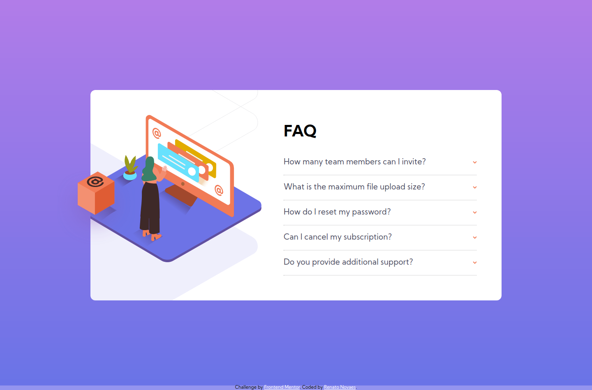
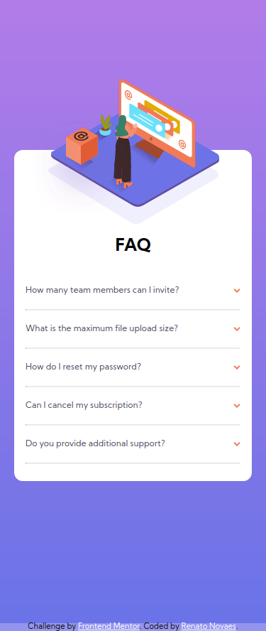

# Frontend Mentor - FAQ accordion card solution

This is a solution to the [FAQ accordion card challenge on Frontend Mentor](https://www.frontendmentor.io/challenges/faq-accordion-card-XlyjD0Oam). Frontend Mentor challenges help you improve your coding skills by building realistic projects. 

## Table of contents

- [Overview](#overview)
  - [The challenge](#the-challenge)
  - [Screenshot](#screenshot)
  - [Links](#links)
- [My process](#my-process)
  - [Built with](#built-with)
  - [What I learned](#what-i-learned)
  - [Continued development](#continued-development)
  - [Useful resources](#useful-resources)
- [Author](#author)
## Overview

### The challenge

Users should be able to:

- View the optimal layout for the component depending on their device's screen size
- See hover states for all interactive elements on the page
- Hide/Show the answer to a question when the question is clicked

### Screenshot

### Links

- Live Site URL: [Netlify](https://keen-pasteur-d3d17e.netlify.app/)

## My process

### Built with

- Semantic HTML5 markup
- CSS custom properties
- Flexbox
- Mobile-first workflow

### What I learned
  
Still strungling with background posicion. The overflow effect in the desktop version was a great challenge and I really enjoy how to work with the background and the image. It was tricky to understand how it was made.

### Continued development

I really would like to correct how I used the background-position.  
  
Add the use of SASS/SCSS to a better CSS file.

### Useful resources

- [Background Gradient](https://www.w3schools.com/css/css3_gradients.asp) - To make the background of the website. I didn't remember how to use it. Here I found really helpful resources.
- [The dl tag](https://www.w3schools.com/tags/tag_dl.asp) - This is something we really should be aware: the HTML needs a good semantic. Of course everything can be done using 
 and , but it's important to know the tags and use them correctly to better acessibility and search tools.
- [Styling the hr tag](https://www.w3schools.com/howto/howto_css_style_hr.asp) - A really simple tag, but got me stuck to styling. Once again a really good link to show me how to style properly.

## Author

- Website - [Renato Novaes](https://www.renatonovaes.dev)
- Instagram - [@novaes_r](https://www.instagram.com/novaes_r)
